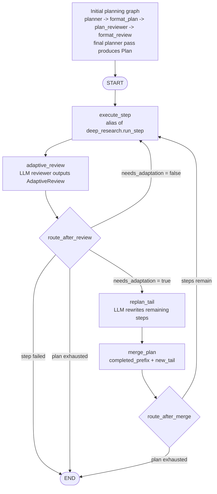

# Section II Context: Adaptive Planning in `cmbagent_lg`

This is a factual study/context file for answering Part II of `coursework.md`.
It is deliberately fuller than the final 2-page report section should be.

Exact branch/commit studied:
<https://github.com/borisbolliet/cmbagent_lg/tree/d7d0592a714e4cc01c97f1b77afdd57a208b18db>

Local checkout:
- Repository path: `lg/`
- Branch: `adaptive-planning`
- Commit: `d7d0592a714e4cc01c97f1b77afdd57a208b18db`

## Coursework Requirements

Part II asks for three things:

1. **II.1 Workflow diagram, 12 marks**
   - Draw the adaptive-planning workflow as implemented.
   - Include LangGraph nodes, edges, conditional routing, and state.
   - Add a short walkthrough, at most half a page.
   - Make explicit:
     - what triggers a plan revision;
     - what part of the plan may change;
     - what is held fixed across a revision;
     - how the loop is guaranteed to terminate.

2. **II.2 Problems, 9 marks**
   - Identify significant problems, limitations, or failure modes.
   - Each problem must be argued, not just asserted.
   - Ground the argument in lecture material on planning and closed-loop control.

3. **II.3 Proposed improvements, 9 marks**
   - Propose concrete improvements for the problems in II.2.
   - For each improvement state:
     - what changes;
     - why it addresses the problem;
     - what it trades off, such as cost, latency, complexity, or new failure modes.

The Part II report text is limited to at most 2 pages, excluding the workflow diagram.

## Repository Snapshot

Relevant modules:

- `cmbagent_lg/adaptive_planning/graph.py`: compiled adaptive LangGraph graph.
- `cmbagent_lg/adaptive_planning/nodes.py`: adaptive node implementations and routers.
- `cmbagent_lg/adaptive_planning/state.py`: `AdaptivePlanState`.
- `cmbagent_lg/adaptive_planning/schemas.py`: `AdaptiveReview`.
- `cmbagent_lg/adaptive_planning/prompts.py`: adaptive reviewer and replanner prompts.
- `cmbagent_lg/planning/*`: initial planner and plan-reviewer propose/critique loop.
- `cmbagent_lg/deep_research/*`: step-by-step plan execution reused by adaptive planning.

Important source facts:

- The adaptive graph topology is defined in `cmbagent_lg/adaptive_planning/graph.py:31-50`.
- `execute_step` is not a new executor. It is an alias of `deep_research.nodes.run_step`, imported in `cmbagent_lg/adaptive_planning/nodes.py:45`.
- The adaptive reviewer reads the latest step summary, latest step outcome, and remaining steps in `cmbagent_lg/adaptive_planning/nodes.py:57-77`, using prompt builders from `cmbagent_lg/adaptive_planning/prompts.py:10-34`.
- The replanner rewrites the remaining tail using completed summaries, current remaining plan, and reviewer recommendations in `cmbagent_lg/adaptive_planning/nodes.py:83-110`.
- `merge_plan` splices `completed_prefix + new_tail` in `cmbagent_lg/adaptive_planning/nodes.py:116-134`.
- Routing halts on failed step or exhausted plan, otherwise either adapts or continues, in `cmbagent_lg/adaptive_planning/nodes.py:140-157`.
- The state shape is defined in `cmbagent_lg/adaptive_planning/state.py:24-40`.
- The initial planner/reviewer loop uses `num_rounds + 1` planner passes and keeps review history in `cmbagent_lg/planning/nodes.py:100-115` and `cmbagent_lg/planning/nodes.py:217-232`.
- `run_step` checkpoints via inherited deep-research persistence, but adaptive history is not included in that checkpoint. See `cmbagent_lg/deep_research/nodes.py:39-54` and `cmbagent_lg/deep_research/nodes.py:224-232`.
- The top-level package export in `cmbagent_lg/__init__.py` exposes planning, self-debug, researcher, and deep-research graphs, but not the adaptive-planning graph. The adaptive graph must be imported from `cmbagent_lg.adaptive_planning`.

## Adaptive Workflow

The adaptive graph consumes an already-created `Plan`. Initial planning is done separately by `cmbagent_lg.planning`, where a planner and plan-reviewer run a propose/critique loop. The final plan from that loop is then executed by `cmbagent_lg.adaptive_planning`.

Actual adaptive graph:

```text
START
  -> execute_step
  -> adaptive_review
       -> replan_tail -> merge_plan -> execute_step
       -> execute_step
       -> END
```

The key closed-loop behavior is: after every successful step, the system asks an LLM reviewer whether the remaining plan still makes sense in light of the latest result. If the reviewer sets `needs_adaptation=True`, an LLM replanner replaces only the unexecuted tail. Execution then resumes at the current `step_index`.

## State Threaded Through Graph

`AdaptivePlanState` is a superset of `DeepResearchState`. It carries:

- `plan`: the current mutable `Plan`; only its unexecuted tail may be rewritten.
- `work_dir`: optional run directory used by inherited deep-research execution and checkpointing.
- `step_index`: 1-based pointer to the next step to execute. `run_step` increments it after each executed step.
- `step_summaries`: one summary block per completed step. For engineer steps, this includes executed code and stdout. For researcher steps, this includes the written report.
- `step_outcomes`: structured per-step outcomes such as `step_number`, `fulfilled`, `attempts`, `escalated`, and optional failure reason.
- `adaptive_review`: latest `AdaptiveReview` object, containing `needs_adaptation`, `recommendations`, and `reason`.
- `new_tail`: replacement `Plan` for the remaining steps before it is merged.
- `adaptive_history`: minimal list of applied revisions, each recording `after_step` and reviewer `recommendations`.
- `node_elapsed_s`: timing data appended by timed nodes.

The important control variables are `plan`, `step_index`, `step_summaries`, `step_outcomes`, `adaptive_review`, `new_tail`, and `adaptive_history`.

## Node Responsibilities

### Initial `planning`

The initial plan is generated outside the adaptive graph by `cmbagent_lg.planning`. Its graph is:

```text
planner -> format_plan -> plan_reviewer -> format_review -> planner ...
```

`num_rounds` counts review cycles. The graph always finishes on a planner pass, so total planner passes are `num_rounds + 1`. The planner sees prior rounds through `_render_history`, which reduces the chance of reintroducing earlier reviewed mistakes.

### `execute_step`

`execute_step` is `deep_research.nodes.run_step` reused unchanged.

For the current `step_index`, it:

- selects `plan.sub_tasks[step_index - 1]`;
- builds cross-step context from previous summaries and workspace file manifest;
- dispatches to `self_debug_graph` for `engineer` steps or `researcher_graph` for `researcher` steps;
- creates a per-step outcome;
- appends a step summary;
- checkpoints `logs/deep_research_run.json`;
- returns `step_index + 1`.

Unsupported agents produce a failed outcome and advance the step pointer, after which routing ends the graph.

### `adaptive_review`

The adaptive reviewer is called after `execute_step`.

Inputs to the reviewer:

- overall task from `PlanContext.main_task`;
- latest step summary;
- latest step outcome;
- formatted remaining steps, computed as `plan.sub_tasks[n_done:]`.

Output schema: `AdaptiveReview`.

Fields:

- `needs_adaptation`: boolean used directly by the router;
- `recommendations`: concrete changes for the remaining steps;
- `reason`: short justification.

This is the trigger point for plan revision. There is no separate numeric uncertainty estimate, value estimate, cost estimate, or external environment monitor.

### `replan_tail`

Runs only when `adaptive_review.needs_adaptation` is true.

Inputs to the replanner:

- overall task from `PlanContext.main_task`;
- completed step summaries;
- current remaining steps;
- reviewer recommendations.

It builds a dynamic `Plan` model constrained to `ctx.available_agents`, asks the planner model for a replacement tail, and returns it as `new_tail`.

### `merge_plan`

`merge_plan` computes:

```python
completed_prefix = plan.sub_tasks[:n_done]
merged = Plan(sub_tasks=completed_prefix + new_tail)
```

This means the already executed prefix is fixed and cannot be edited. The unexecuted tail is replaced wholesale by the new tail. The node also appends a minimal adaptive-history entry:

```python
{"after_step": n_done, "recommendations": list(...)}
```

### Routers

`route_after_review`:

- returns `END` if the latest step outcome has `fulfilled=False`;
- returns `END` if `step_index > len(plan.sub_tasks)`;
- returns `replan_tail` if `adaptive_review.needs_adaptation=True`;
- otherwise returns `execute_step`.

`route_after_merge`:

- returns `END` if the merged plan is exhausted;
- otherwise returns `execute_step`.

## Diagram Source

Mermaid diagram suitable for the report or appendix:



State labels to mention around the diagram:

- Execution state: `plan`, `step_index`, `step_summaries`, `step_outcomes`, `work_dir`.
- Adaptive state: `adaptive_review`, `new_tail`, `adaptive_history`.
- Context: `PlanContext`, especially `main_task`, role model choices, `available_agents`, and execution budgets.

## What Changes / What Stays Fixed

What may change:

- Only the not-yet-executed tail of `plan.sub_tasks`.
- The number, order, and content of future steps.
- Future agent assignments, but only among `ctx.available_agents`, because `replan_tail` uses the dynamic plan model from the planning module.

What stays fixed:

- Completed prefix: all steps before `n_done`.
- Completed outputs: step summaries, step outcomes, files already written to the workspace.
- The 1-based execution pointer, apart from normal advancement by `run_step`.
- The run context, including the overall task and available agents.

Important nuance:

- The replacement tail is a full replacement for the current remaining tail, not a patch or diff.
- The completed prefix is fixed by code in `merge_plan`, not merely by prompting.

## Termination

Termination is guaranteed under the implemented routing if each LLM call returns and each step execution returns.

The graph ends when:

- the latest step failed: `step_outcomes[-1]["fulfilled"]` is false;
- the plan is exhausted: `step_index > len(plan.sub_tasks)`;
- after a merge, the new plan has no remaining steps.

Otherwise execution continues. Each `execute_step` advances `step_index` by one. A replanned tail may shorten the plan, leave it similar length, or lengthen it. There is no explicit `max_adaptive_revisions` counter, so the practical bound comes from eventual plan exhaustion plus the assumption that replanning does not continually extend the tail forever.

## Critique Candidates

These are candidate problems to turn into II.2 arguments. The final report should use only the strongest few.

### 1. Adaptation trigger is under-specified and entirely LLM-judged

The trigger is `AdaptiveReview.needs_adaptation`, a single boolean emitted by an LLM reviewer. The implementation does not require the reviewer to estimate confidence, expected value of revising, cost, risk, or uncertainty. This creates a weak closed-loop controller: the controller observes the latest step summary and decides whether to replan, but it has no explicit control objective or threshold.

Lecture connection:

- Closed-loop planning should revise actions based on feedback from execution, but a good controller needs an error signal or policy for when intervention is worth it.
- Here the feedback path exists, but the decision criterion is informal natural-language judgment.

Why it matters:

- False positives waste tokens and latency by rewriting a tail that was still adequate.
- False negatives leave stale future steps in place after new evidence invalidates them.
- The system cannot easily audit whether an adaptation was warranted.

### 2. Step failure halts before adaptive recovery

`route_after_review` ends the graph immediately when the latest outcome has `fulfilled=False`. That means a failed execution step is not treated as a signal for replanning the remaining plan. The system adapts only after fulfilled steps.

Lecture connection:

- In closed-loop control, failure observations are often the most informative feedback.
- A robust adaptive planner should distinguish unrecoverable failure from recoverable plan mismatch.

Why it matters:

- If a step fails because the plan chose the wrong method, wrong agent, impossible dependency, or unavailable data, the adaptive planner cannot rewrite the tail or insert a repair step.
- Recovery is delegated only to the nested `self_debug` or `researcher` retry loop. Once that loop gives up, outer-level planning stops.

### 3. Reviewer context is narrow

The adaptive reviewer sees the latest summary/outcome and the remaining steps. It does not receive the full original plan, the initial planner/reviewer history, or prior adaptive review reasons except insofar as they are implicit in completed summaries and current tail.

Lecture connection:

- Closed-loop replanning needs enough state to avoid myopic local corrections.
- Maintaining belief/state history matters when current action choice depends on earlier commitments.

Why it matters:

- The reviewer may miss global task coverage issues introduced by earlier revisions.
- It may adapt based on a local latest result while ignoring constraints from the original plan.
- It may reintroduce a problem that the initial plan-reviewer loop had already corrected.

### 4. Replanned tail is not validated after generation

The initial planning module has a planner/reviewer loop. The adaptive tail replanner does not. It directly generates `new_tail`, and `merge_plan` splices it into the active plan. The dynamic schema constrains agent names, but it does not check task coverage, consistency with completed artifacts, budget, redundancy, or whether reviewer recommendations were actually followed.

Lecture connection:

- Plan repair can introduce new defects; adaptive control can destabilize a system if each correction is unverified.
- Closed-loop systems need monitoring not only of the environment but also of their own control actions.

Why it matters:

- A bad tail can silently replace a good remaining plan.
- The system can drift from the original task.
- The final report/result can become less coherent after adaptation.

### 5. No explicit revision budget or oscillation guard

The implementation has no `max_adaptive_revisions`, no maximum final plan length, and no check that the new tail is shorter or bounded relative to the old tail. Termination relies on step execution advancing and on tails eventually exhausting.

Lecture connection:

- Closed-loop control trades adaptivity against stability and cost.
- A controller can overreact to noise and oscillate if adaptations are not regularized.

Why it matters:

- Repeated tail rewrites increase LLM cost and latency.
- Replanning could lengthen the plan, delaying termination.
- There is no simple audit signal that adaptation has become excessive.

### 6. Adaptive history is too thin and not persisted in checkpoint

`adaptive_history` records only `after_step` and recommendation strings. It omits the old tail, new tail, reviewer reason, model identity, and whether the recommendation was followed. Inherited checkpointing writes the current plan/outcomes/summaries through `deep_research`, but not the adaptive history.

Lecture connection:

- Closed-loop controllers should be inspectable: decisions should be traceable to observations and actions.
- For agent systems, observability is part of reliability and accountability.

Why it matters:

- A crash/restart can lose the adaptation rationale.
- Debugging why the final plan changed is difficult.
- The final report can cite that adaptation occurred, but evidence is incomplete.

### 7. Adaptive planning is not surfaced in public docs/examples

`README.md` describes planning, self-debug, researcher, and deep-research. The top-level package export does not include `adaptive_planning_graph`, and there is no adaptive example script. The implementation exists, but discoverability is weaker than other graphs.

Lecture connection:

- This is less about planning theory and more about system engineering.
- For agentic systems, a control mechanism that is hard to invoke or inspect is less likely to be evaluated properly.

Why it matters:

- Users may run `deep_research_graph` and never exercise the adaptive branch.
- Lack of examples reduces empirical validation.
- It makes the frozen branch harder to study and reproduce.

## Improvement Candidates

Pair these with the critique points above in II.3. Each one is concrete enough to implement.

### 1. Structured trigger policy

Change:

- Extend `AdaptiveReview` with fields such as:
  - `reason_category`: `invalidated_step`, `new_opportunity`, `redundant_step`, `missing_step`, `no_change`;
  - `confidence`: float in `[0, 1]`;
  - `expected_benefit`: short enum or score;
  - `estimated_extra_steps`;
  - `estimated_extra_cost`;
  - `must_adapt`: boolean for hard failures of the remaining plan.
- Route to `replan_tail` only when a policy threshold is met, for example `needs_adaptation and confidence >= 0.7`.

Why it helps:

- Turns adaptation from an opaque boolean into a more auditable control decision.
- Separates genuine plan invalidation from low-value preference changes.

Tradeoff:

- More schema complexity.
- More prompt burden and possible false precision from LLM-generated scores.

### 2. Failure-aware outer replanning

Change:

- Modify `route_after_review` or add a new `failure_review` node so failed steps can trigger recovery replanning before `END`.
- Give the replanner the failed step, failure reason, completed summaries, and remaining tail.
- Allow actions such as replacing the failed step, inserting a diagnostic step, switching agent, or removing downstream steps that depend on failed outputs.

Why it helps:

- Makes the outer adaptive planner react to one of the most important execution observations: failure.
- Separates local code retries from plan-level recovery.

Tradeoff:

- Risk of masking genuine unrecoverable failures.
- More cost and latency after failures.
- Needs care to avoid repeatedly retrying impossible tasks.

### 3. Post-replan validation before merge

Change:

- Add `validate_new_tail` between `replan_tail` and `merge_plan`.
- Validator checks:
  - new tail uses available agents;
  - new tail addresses reviewer recommendations;
  - no completed step is duplicated;
  - task coverage remains adequate;
  - plan length/budget is acceptable;
  - dependencies on generated files or reports are plausible.
- Route invalid tails back to `replan_tail` with feedback, bounded by a retry count.

Why it helps:

- Restores the plan-review pattern that exists in initial planning.
- Reduces the chance that adaptation makes the plan worse.

Tradeoff:

- Extra LLM call per adaptation.
- Could reject creative but valid repairs.
- Needs a bounded retry policy.

### 4. Revision budget and length guard

Change:

- Add fields to `PlanContext`, for example:
  - `max_adaptive_revisions: int = 2`;
  - `max_total_plan_steps: int = maximum_number_of_steps_in_plan`;
  - `allow_tail_length_increase: bool = False`.
- Have `route_after_review` or `merge_plan` refuse further adaptation when the budget is exhausted.

Why it helps:

- Makes termination and cost bounds explicit.
- Prevents oscillation and plan bloat.

Tradeoff:

- A hard budget may block useful late-stage adaptation.
- Requires choosing defaults appropriate for different task sizes.

### 5. Persist full adaptive history

Change:

- Extend checkpoint persistence to include:
  - original plan;
  - plan version number;
  - old tail and new tail for each revision;
  - reviewer reason and recommendations;
  - model names and timestamps;
  - whether validation passed.

Why it helps:

- Makes adaptive decisions auditable.
- Supports reliable crash recovery.
- Gives concrete evidence for report critique and debugging.

Tradeoff:

- Larger checkpoint files.
- More data to redact if prompts contain sensitive content.

### 6. Feed richer context into reviewer/replanner

Change:

- Include original plan, initial planning review history, adaptive history, and explicit global constraints in adaptive reviewer/replanner prompts.
- Summarize old history if the token budget is tight.

Why it helps:

- Reduces myopic local rewrites.
- Helps preserve global task intent and earlier reviewer corrections.

Tradeoff:

- Higher token cost.
- More context can distract the model unless structured carefully.

### 7. Surface adaptive planning in public API and examples

Change:

- Add a top-level export such as `adaptive_planning_graph`.
- Add `examples/run_adaptive_planning.py`.
- Add a README section showing initial planning followed by adaptive execution.

Why it helps:

- Improves reproducibility and evaluation.
- Makes it clear that adaptive planning is a separate graph from `deep_research`.

Tradeoff:

- Documentation/API maintenance.
- Users may need clearer guidance on when to choose adaptive execution over simple deep research.

## Report Angle

A tight 2-page answer can use this structure:

1. **Workflow paragraph**
   - State that the system is closed-loop because execution feedback is inserted between plan steps.
   - Say initial planning is separate, then adaptive execution begins.
   - Explain that after each successful step, an LLM reviewer decides whether to rewrite the remaining tail.

2. **Diagram**
   - Use the Mermaid diagram above or redraw it cleanly.
   - Label state flowing through the loop.

3. **Short walkthrough**
   - `execute_step` runs the current step and advances `step_index`.
   - `adaptive_review` reads the latest summary/outcome plus remaining steps.
   - If `needs_adaptation`, `replan_tail` creates a replacement tail and `merge_plan` splices it after the completed prefix.
   - If no adaptation is needed, execution continues.
   - Failure or plan exhaustion ends the graph.

4. **Problems**
   - Pick three strong problems:
     - opaque LLM-only trigger;
     - failed steps halt rather than trigger outer replanning;
     - unvalidated tail replacement with limited context/history.
   - Mention revision budget/persistence as secondary if space allows.

5. **Improvements**
   - Pair each problem with one concrete fix:
     - structured trigger policy;
     - failure-aware replanning path;
     - post-replan validation plus revision budget;
     - richer/persisted adaptive history.

Suggested final-report thesis:

> The branch implements a genuine closed-loop planner because execution feedback can rewrite future actions, but the control policy is still weak: adaptation is an LLM judgment with little explicit objective, limited memory, no post-replan validation, and no robust recovery path after step failure.

## Acceptance Checklist

- Exact commit link included.
- All Part II deliverables are represented.
- Mermaid diagram matches the LangGraph edges.
- Workflow notes distinguish initial planning from adaptive execution.
- Trigger, mutable tail, fixed prefix, and termination are explicit.
- Critiques are grounded in implementation details and lecture concepts.
- Improvements include tradeoffs.
- File is context notes, not final report prose.
